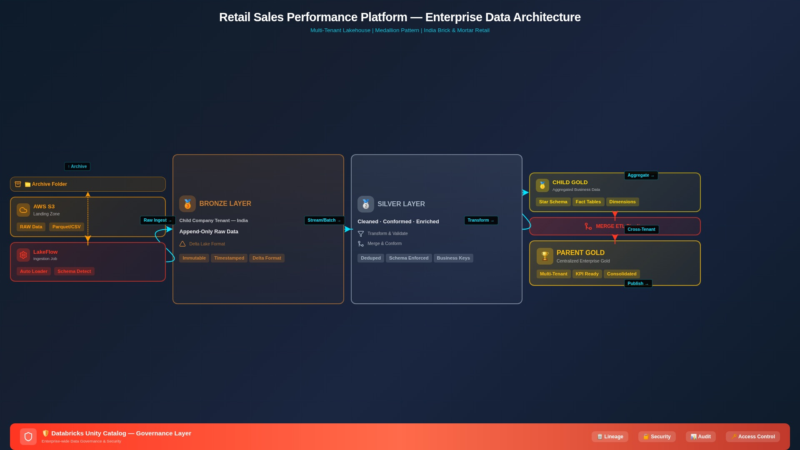

# FMCG Data Lakehouse Consolidation: Parent-Subsidiary Integration

This repository contains the source code, pipeline configurations, and architectural specifications for an enterprise-grade cloud data engineering project. The objective of this project is to consolidate disparate transactional and master data assets from a newly acquired regional subsidiary into a centralized parent Fast-Moving Consumer Goods (FMCG) company Lakehouse.

The solution is built using **Databricks**, **PySpark (Apache Spark)**, **Delta Lake**, and **AWS S3**, leveraging the **Medallion Architecture** to establish a scalable, transactional, and audit-ready data platform.

---

## Table of Contents

- [Business Scenario and Strategic Objectives](#business-scenario-and-strategic-objectives)
- [Technical Solution](#technical-solution)
- [System Architecture](#system-architecture)
- [Architectural Layer Design Decisions](#architectural-layer-design-decisions)
- [Directory Structure](#directory-structure)
- [Technical Implementations and Code Specifications](#technical-implementations-and-code-specifications)
- [Semantic Layer and Business Intelligence Integration](#semantic-layer-and-business-intelligence-integration)
- [Installation, Deployment, and Execution Guide](#installation-deployment-and-execution-guide)
- [Project Context and Attribution](#project-context-and-attribution)

---

## Business Scenario and Strategic Objectives

In the FMCG sector, post-merger integration requires rapid and reliable consolidation of supply chain and sales data to achieve operational visibility. Following a recent corporate acquisition, the parent organization's executive leadership requires a unified, single-source-of-truth semantic layer to perform holistic market, inventory, and revenue analysis.

### Primary Operational Challenges

1. **Granularity and Schema Mismatch** — The subsidiary logs transaction records at different temporal intervals and structures compared to the parent company. Transaction records contain inconsistent currency codes, unit measurements, and naming conventions.
2. **Inconsistent Master Data** — Customer profiles, product catalog metadata, and geographical records are unstandardized. Data anomalies include variations in character casing, orphaned records, and missing values in critical dimensions.
3. **Decentralized Data Silos** — Subsidiary assets remain isolated in legacy AWS S3 storage buckets, lacking direct integrations with central enterprise business intelligence (BI) systems.

---

## Technical Solution

To address these challenges, this project implements a programmatic data pipeline adhering to the Medallion Architecture. Raw data is ingested from the landing zones and progressively refined through **Bronze** (Raw/Append-only), **Silver** (Cleansed/Conformed), and **Gold** (Curated Aggregates and Dimensional Models) layers. The pipeline culminates in an optimized semantic layer that supports enterprise reporting and natural language querying through **Databricks Genie**.

---

## System Architecture



---

## Architectural Layer Design Decisions

### Bronze Layer (Raw Storage)

- **Design Philosophy:** Low-latency ingestion preserving the state of the source system. No structural transformations or business rules are applied at this stage.
- **Storage Format:** Read from CSV/Parquet source files and saved as Delta tables with an append-only configuration.
- **Metadata Enrichment:** Standard audit columns are appended, including ingestion timestamp, input file path, and processing run ID.

### Silver Layer (Cleaned and Conformed Data)

- **Design Philosophy:** Standardized data representation serving as the corporate source of truth.
- **Transformations:** Enforcement of strict schema validation, type-casting, deduplication, string normalization (e.g., casing consolidation), and relational integrity validation.
- **Handling Missing Values:** Business logic maps missing geographic properties using historical profiles and deterministic fallbacks.

### Gold Layer (Business Semantics and Analytics)

- **Design Philosophy:** High-performance analytical layer structured for downstream consumption.
- **Data Modeling:** Implementation of a Star Schema consisting of Fact and Dimension tables, along with an optimized One Big Table (OBT) design for direct dashboard integration and machine learning modeling.
- **Processing Mechanics:** Merges incremental updates from Silver tables into Gold structures using high-efficiency merge operations.

---

## Directory Structure

```
├── 1_setup/
│   ├── 1.1_catalog_setup.sql      # Catalog and schema initialization (Bronze/Silver/Gold)
│   ├── 1.2_s3_connection.py       # Establishing secure connectivity with S3 landing buckets
│   └── config.py                  # Global configuration, S3 paths, and environment parameters
├── 2_bronze/
│   └── raw_ingestion.py           # Generic notebook parameterized to read S3 and write raw Delta
├── 3_silver/
│   ├── dim_processing.py          # Standardizing, deduplicating, and cleaning master data (SCD1/2)
│   └── fact_processing.py         # Processing, partitioning, and storing clean historical/incremental order records
├── 4_gold/
│   ├── gold_analytics.py          # Building final analytical star-schema and One Big Table (OBT)
│   └── dim_date.sql               # SQL-based date dimension script
├── 5_orchestration/
│   └── workflow_definition.json   # JSON representation of Databricks Job dependencies
└── README.md                      # Documentation
```

---

## Technical Implementations and Code Specifications

### 1. Catalog and Schema Isolation

Using Unity Catalog, we establish secure namespaces across three logical environments to ensure strict data isolation and access control boundaries.

```sql
-- Establish Enterprise Namespace
CREATE CATALOG IF NOT EXISTS fmcg;
USE CATALOG fmcg;

-- Initialize Layered Architecture Schemas
CREATE SCHEMA IF NOT EXISTS bronze;
CREATE SCHEMA IF NOT EXISTS silver;
CREATE SCHEMA IF NOT EXISTS gold;
```

### 2. Silver Layer Quality Engineering

At the Silver stage, data quality validation and normalization are executed using PySpark. This stage standardizes capitalization, deduplicates redundant inputs, and imputes null entries through dynamic lookup values.

```python
from pyspark.sql.functions import col, initcap, when

# Deduplicate based on Unique IDs to enforce primary key constraints
df_silver = df_bronze.dropDuplicates(["customer_id"])

# Standardize text strings to prevent grouping errors during aggregation
df_silver = df_silver.withColumn("customer_name", initcap(col("customer_name"))) \
    .withColumn("city", initcap(col("city")))

# Map missing values using a deterministic dictionary mapping
city_mapping = {"Customer A": "London", "Customer B": "New York"}
df_silver = df_silver.withColumn(
    "city",
    when(col("city").isNull(),
         col("customer_name").map_values(city_mapping)).otherwise(col("city"))
)
```

### 3. Gold Layer Incremental Merge Mechanics

To optimize compute efficiency and avoid the overhead of full table rewrites, data updates in the Gold Fact tables are handled incrementally using Spark SQL `MERGE INTO` operations.

```sql
MERGE INTO fmcg.gold.fact_sales AS target
USING fmcg.silver.incremental_orders AS source
ON target.order_id = source.order_id
WHEN MATCHED THEN
  UPDATE SET
    target.quantity = source.quantity,
    target.revenue = source.revenue,
    target.last_updated = current_timestamp()
WHEN NOT MATCHED THEN
  INSERT (order_id, date_key, customer_id, product_id, quantity, revenue, last_updated)
  VALUES (source.order_id, source.date_key, source.customer_id, source.product_id,
          source.quantity, source.revenue, current_timestamp());
```

---

## Semantic Layer and Business Intelligence Integration

Following consolidation, data assets in the Gold Layer are prepared for downstream consumption via the Databricks Lakehouse.

### 1. Databricks SQL Dashboards

The Gold Layer structures are connected to enterprise SQL Warehouses to power executive BI dashboards. Visualizations include:

- Real-time Revenue Decomposition by Region and Store Type
- Product Category Growth Velocity
- Incremental Margin Analysis comparing legacy parent and newly acquired subsidiary branches

### 2. Databricks Genie Space Integration

To enable non-technical business leaders to extract ad-hoc business insights, a Databricks Genie Space is configured on top of the Gold semantic layer.

- Databricks Genie uses generative artificial intelligence models to parse natural language queries, translate them into optimized Spark SQL statements, execute the query against the Lakehouse, and return clear tabular outputs and charts.
- **Example Natural Language Input:** *"Detail the weekly total revenue contribution of the acquired subsidiary's retail locations within the London metropolitan area for the previous fiscal quarter."*

---

## Installation, Deployment, and Execution Guide

### Prerequisites

- **Databricks Workspace:** Either Databricks Community Edition or a managed cloud environment (AWS/Azure/GCP).
- **AWS Environment:** An S3 storage bucket containing landing datasets, with appropriate AWS Identity and Access Management (IAM) role permissions configured for Databricks execution.
- **Sample Data:** FMCG structured CSV and Parquet transaction logs.

### Step-by-Step Orchestration

1. **Storage Setup** — Provision folders in your cloud bucket for raw datasets. Upload source files to their respective landing directories:
   - `s3://<your-project>/fmcg-data/customers/`
   - `s3://<your-project>/fmcg-data/orders/`
   - `s3://<your-project>/fmcg-data/products/`
2. **Environment Initialization** — Execute the SQL statements in `1_setup/1.1_catalog_setup.sql` within a Databricks Notebook or SQL Editor to create the standard catalogs and schemas.
3. **Connectivity Configuration** — Edit `1_setup/config.py` with your S3 path configurations and security configurations (leveraging Databricks Secrets to protect credentials).
4. **Bronze Layer Pipeline Ingestion** — Execute `2_bronze/raw_ingestion.py` to ingest raw landing files into Delta format within the Bronze schema.
5. **Silver Layer Processing** — Execute the transformation scripts located in the `3_silver/` directory to run deduplication and standardization workflows.
6. **Gold Layer Modeling** — Run the notebooks in the `4_gold/` directory to generate optimized dimensional modeling tables.
7. **Automated Orchestration** — Import the workflow dependency graph defined in `5_orchestration/workflow_definition.json` into Databricks Workflows to schedule, monitor, and automate execution of the entire pipeline.

---

## Project Context and Attribution

This architecture is modeled after an end-to-end data engineering scenario designed by **Codebasics**. The project demonstrates the application of enterprise design patterns (Medallion Architecture, dimensional modeling, Unity Catalog governance, and generative AI reporting layers) to solve a complex consolidation challenge in the FMCG sector.
